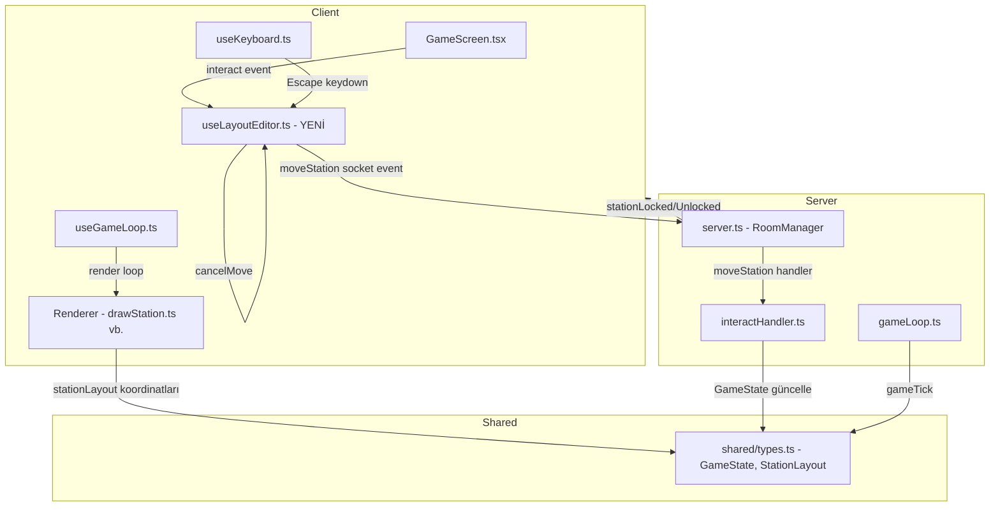
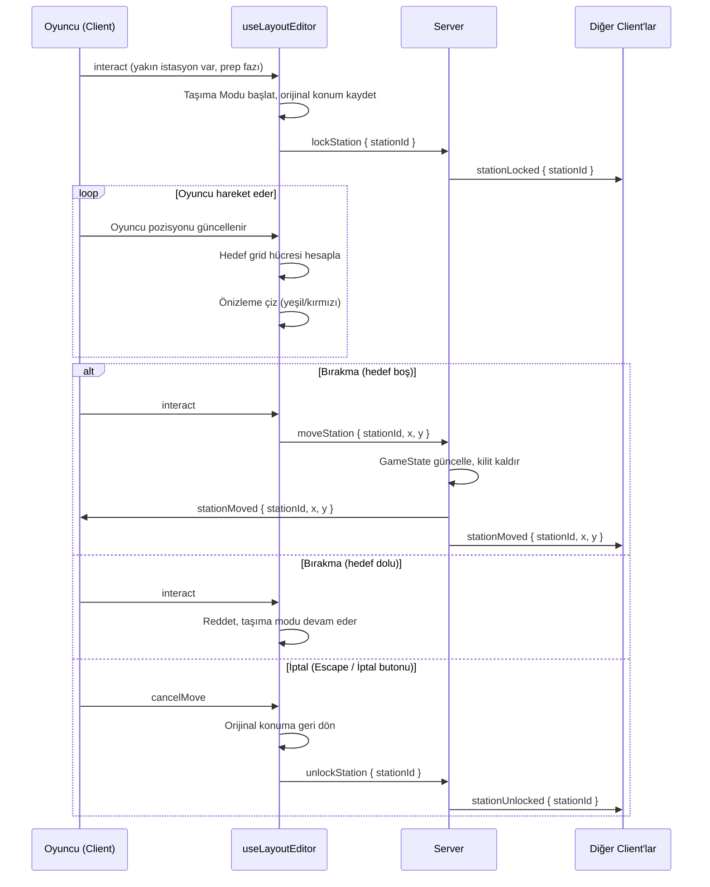

# Tasarım Belgesi: Station Layout Editor

## Genel Bakış

Bu özellik, PlateUp tarzı restoran oyununa **prep (hazırlık) fazında** mutfak istasyonlarını yeniden düzenleme imkânı tanır. Oyuncular gün başlamadan önce malzeme istasyonlarını, fırınları, servis tezgahlarını ve yardımcı istasyonları (tepsi, lavabo, çöp) istedikleri konuma taşıyarak kendi iş akışlarını optimize edebilir.

Sistem mevcut multiplayer altyapısına entegre olur: Socket.io üzerinden gerçek zamanlı senkronizasyon, `GameState` içinde tek doğruluk kaynağı, ve mevcut `interact` event akışının yeniden kullanımı.

Taşıma akışı sürükle-bırak değil, "yaklaş → interact → taşıma modu → hareket et → interact → bırak" şeklindedir. Bu, mevcut mobil joystick + AL/VER butonu ve PC E/Boşluk tuşu altyapısıyla tam uyumludur.

---

## Mimari

### Yüksek Seviye Bileşen Diyagramı



### Veri Akışı: Taşıma İşlemi



---

## Bileşenler ve Arayüzler

### 1. `shared/types.ts` — Veri Modeli Genişletmesi

`GameState`'e yeni alanlar eklenir:

```typescript
// Taşınabilir istasyon tanımı
export interface StationPosition {
  id: string;       // Benzersiz istasyon kimliği (örn. "ingredient_🍞", "oven1", "tray")
  x: number;        // Piksel koordinatı (grid'e snap'lenmiş)
  y: number;
}

// GameState'e eklenen alanlar:
// stationLayout: Record<string, StationPosition>
//   Her istasyonun güncel konumu. Key = stationId.
// lockedStations: Record<string, string>
//   Kilitli istasyonlar. Key = stationId, Value = kilitleyen socketId.
```

### 2. `server/layoutHandler.ts` — YENİ

Tüm layout ile ilgili socket event'lerini yönetir.

```typescript
export function registerLayoutHandler(
  socket: Socket,
  io: Server,
  getRoomId: () => string | null,
  getRoomState: (rid: string) => GameState | undefined
): void

// Dinlenen event'ler:
// "lockStation"   → { stationId: string }
// "moveStation"   → { stationId: string, x: number, y: number }
// "unlockStation" → { stationId: string }

// Yayımlanan event'ler:
// "stationLocked"   → { stationId: string, lockedBy: string }
// "stationUnlocked" → { stationId: string }
// "stationMoved"    → { stationId: string, x: number, y: number }
```

### 3. `src/hooks/useLayoutEditor.ts` — YENİ

Client tarafında taşıma modu state'ini ve mantığını yönetir.

```typescript
export interface LayoutEditorState {
  isMoving: boolean;
  movingStationId: string | null;
  originalPos: { x: number; y: number } | null;
  previewPos: { x: number; y: number } | null;
  isPreviewValid: boolean;  // Hedef hücre boş mu?
}

export function useLayoutEditor(params: {
  socket: Socket | null;
  gameStateRef: React.MutableRefObject<GameState>;
  localPlayerRef: React.MutableRefObject<{ x: number; y: number }>;
  dayPhase: string;
}): {
  editorState: LayoutEditorState;
  handleInteract: () => void;   // interact event'i geldiğinde çağrılır
  handleCancel: () => void;     // Escape veya İptal butonu
  editorStateRef: React.MutableRefObject<LayoutEditorState>;
}
```

### 4. `src/renderer/drawLayoutEditor.ts` — YENİ

Taşıma modu sırasında canvas üzerine önizleme ve grid çizer.

```typescript
export function drawLayoutPreview(
  ctx: CanvasRenderingContext2D,
  editorState: LayoutEditorState,
  stationLayout: Record<string, StationPosition>
): void

export function snapToGrid(pixelX: number, pixelY: number): { x: number; y: number }
export function pixelToGridIndex(pixelX: number, pixelY: number): { col: number; row: number }
export function gridIndexToPixel(col: number, row: number): { x: number; y: number }
export function isGridCellOccupied(
  col: number, row: number,
  layout: Record<string, StationPosition>,
  excludeId?: string
): boolean
```

### 5. `src/components/GameScreen.tsx` — Değişiklik

- `useLayoutEditor` hook'u entegre edilir
- Prep fazında "İptal" butonu ve HUD ipuçları eklenir
- `interact` event'i önce `handleInteract`'e yönlendirilir

### 6. `server/interactHandler.ts` — Değişiklik

Sabit koordinat referansları `GameState.stationLayout`'tan okunacak şekilde güncellenir:

```typescript
// Önce (sabit):
if (Math.hypot(px - SINK_STATION.x, py - SINK_STATION.y) < 90) { ... }

// Sonra (dinamik):
const sinkPos = gs.stationLayout['sink'] ?? SINK_STATION;
if (Math.hypot(px - sinkPos.x, py - sinkPos.y) < 90) { ... }
```

---

## Veri Modelleri

### `StationPosition`

```typescript
export interface StationPosition {
  id: string;
  x: number;   // Grid'e snap'lenmiş piksel X
  y: number;   // Grid'e snap'lenmiş piksel Y
}
```

### `GameState` Genişletmesi

```typescript
export interface GameState {
  // ... mevcut alanlar ...

  // YENİ: İstasyon layout'u
  stationLayout: Record<string, StationPosition>;

  // YENİ: Kilitli istasyonlar (multiplayer)
  lockedStations: Record<string, string>; // stationId → socketId
}
```

### `stationLayout` Başlangıç Değerleri (`mkGameState`)

```typescript
stationLayout: {
  // Malzeme istasyonları
  'ingredient_🍞': { id: 'ingredient_🍞', x: 100, y: 65 },
  'ingredient_🥩': { id: 'ingredient_🥩', x: 190, y: 65 },
  'ingredient_🥬': { id: 'ingredient_🥬', x: 280, y: 65 },
  'ingredient_🥘': { id: 'ingredient_🥘', x: 370, y: 65 },
  'ingredient_🍢': { id: 'ingredient_🍢', x: 460, y: 65 },
  // Fırınlar (cookStations'dan türetilir)
  'oven1': { id: 'oven1', x: 200, y: 170 },
  // Yardımcı istasyonlar
  'tray':  { id: 'tray',  x: 80,  y: 170 },
  'sink':  { id: 'sink',  x: 1180, y: 90 },
  'trash': { id: 'trash', x: 1200, y: 190 },
  'dirty_tray': { id: 'dirty_tray', x: 1050, y: 90 },
  // Servis tezgahları (counter0..counter11)
  'counter0': { id: 'counter0', x: 180, y: 245 },
  // ... diğerleri
}
```

### Grid Sabitleri

```typescript
export const GRID_CELL_SIZE = 40;  // piksel
export const GRID_COLS = Math.floor(GAME_WIDTH / GRID_CELL_SIZE);   // 32
export const GRID_ROWS = Math.floor(GAME_HEIGHT / GRID_CELL_SIZE);  // 18
```

### Socket Event Şemaları

```typescript
// Client → Server
interface LockStationPayload   { stationId: string }
interface MoveStationPayload   { stationId: string; x: number; y: number }
interface UnlockStationPayload { stationId: string }

// Server → Client
interface StationLockedPayload   { stationId: string; lockedBy: string }
interface StationUnlockedPayload { stationId: string }
interface StationMovedPayload    { stationId: string; x: number; y: number }
```

---

## Doğruluk Özellikleri

*Bir özellik (property), sistemin tüm geçerli çalışmalarında doğru olması gereken bir karakteristik veya davranıştır — temelde sistemin ne yapması gerektiğine dair biçimsel bir ifadedir. Özellikler, insan tarafından okunabilir spesifikasyonlar ile makine tarafından doğrulanabilir doğruluk garantileri arasındaki köprüyü oluşturur.*

### Özellik 1: Grid Snap Round-Trip

*Herhangi bir* piksel koordinatı `(x, y)` için, `snapToGrid(x, y)` → `pixelToGridIndex` → `gridIndexToPixel` işlem zinciri, `snapToGrid` ile aynı koordinatı üretmelidir.

**Doğrular: Gereksinim 1.1, 1.2, 1.3**

---

### Özellik 2: Taşıma Modu Başlatma Koşulları

*Herhangi bir* oyuncu konumu, istasyon konumu ve oyun fazı için:
- `dayPhase === 'prep'` VE mesafe `< 75px` VE `holding === null` VE istasyon taşınabilir ise → taşıma modu başlamalıdır
- Bu koşullardan herhangi biri sağlanmıyorsa → taşıma modu başlamamalıdır

**Doğrular: Gereksinim 2.1, 2.3, 2.5, 2.6, 2.7**

---

### Özellik 3: Çakışma Tespiti

*Herhangi bir* iki istasyon konumu için, aynı grid hücresini işgal ediyorlarsa `isGridCellOccupied` `true` döndürmeli; farklı hücrelerdeyse `false` döndürmelidir.

**Doğrular: Gereksinim 3.3, 4.2**

---

### Özellik 4: Başarılı Bırakma Sonrası Konum Güncelleme

*Herhangi bir* boş hedef grid hücresi için, bırakma işlemi sonrası `stationLayout[stationId]` o hücrenin snap'lenmiş koordinatlarına eşit olmalı ve taşıma modu sona ermiş olmalıdır.

**Doğrular: Gereksinim 4.1, 4.3**

---

### Özellik 5: İptal Round-Trip

*Herhangi bir* taşıma modu durumu için, iptal işlemi sonrası `stationLayout[stationId]` taşıma başlamadan önceki orijinal koordinatlara eşit olmalıdır.

**Doğrular: Gereksinim 5.1, 5.2, 5.4**

---

### Özellik 6: Layout Broadcast

*Herhangi bir* başarılı `moveStation` işlemi için, aynı odadaki tüm client'ların `stationLayout[stationId]` değeri güncellenmiş koordinatları yansıtmalıdır.

**Doğrular: Gereksinim 4.4, 6.1, 6.2**

---

### Özellik 7: İstasyon Kilidi Round-Trip

*Herhangi bir* istasyon için, bir oyuncu tarafından kilitlendiğinde başka bir oyuncu taşıma modunu başlatamamalı; kilit serbest bırakıldıktan sonra ise başka bir oyuncu taşıma modunu başlatabilmelidir.

**Doğrular: Gereksinim 6.3, 6.4**

---

### Özellik 8: Oda İzolasyonu

*Herhangi iki* farklı oda için, birindeki `lockedStations` veya `stationLayout` değişikliği diğerini etkilememelidir.

**Doğrular: Gereksinim 6.5**

---

### Özellik 9: Taşıma Sonrası Etkileşim Mesafesi

*Herhangi bir* istasyon için, yeni konuma taşındıktan sonra oyuncu yeni konuma `< INTERACT_R` mesafede iken etkileşim başarılı olmalı; eski konumda ise etkileşim başarısız olmalıdır.

**Doğrular: Gereksinim 7.1, 7.3, 7.4**

---

### Özellik 10: Benzersiz İstasyon ID'leri

*Herhangi bir* `GameState` için, `stationLayout` içindeki tüm `id` değerleri birbirinden farklı olmalıdır.

**Doğrular: Gereksinim 8.4**

---

### Özellik 11: Layout Serileştirme Round-Trip

*Herhangi bir* geçerli `stationLayout` nesnesi için, `JSON.stringify` ardından `JSON.parse` işlemi eşdeğer bir nesne üretmelidir.

**Doğrular: Gereksinim 10.1, 10.2, 10.3**

---

### Özellik 12: Hatalı Layout Verisi Dayanıklılığı

*Herhangi bir* geçersiz veya eksik `stationLayout` verisi için, client mevcut layout'u koruyarak çökmemeli ve hatayı günlüğe kaydetmelidir.

**Doğrular: Gereksinim 10.4**

---

## Hata Yönetimi

### Server Tarafı

| Durum | Davranış |
|---|---|
| `moveStation` prep fazı dışında gelirse | Event yoksayılır, `"fail"` sesi emit edilir |
| Kilitli istasyona başka oyuncu `lockStation` gönderirse | `stationLocked` event'i tekrar gönderilir, işlem reddedilir |
| Geçersiz `stationId` gelirse | Event yoksayılır |
| Hedef koordinat grid dışındaysa | Koordinat sınırlara kırpılır (clamp) |
| Oyuncu disconnect olursa | Kilitlediği tüm istasyonlar serbest bırakılır, `stationUnlocked` broadcast edilir |

### Client Tarafı

| Durum | Davranış |
|---|---|
| `stationMoved` alındığında `stationId` bulunamazsa | Hata loglanır, mevcut layout korunur |
| Geçersiz JSON alınırsa | `try/catch` ile yakalanır, mevcut layout korunur |
| Taşıma modundayken `dayPhase` değişirse (gün başlarsa) | Taşıma modu otomatik iptal edilir |
| Ağ gecikmesi sırasında çift `interact` gelirse | İkinci event yoksayılır (debounce) |

---

## Test Stratejisi

### Birim Testleri

Belirli örnekler ve kenar durumları için:

- `snapToGrid(0, 0)` → `{ x: 20, y: 20 }` (ilk hücre merkezi)
- `snapToGrid(39, 39)` → `{ x: 20, y: 20 }` (hâlâ ilk hücre)
- `snapToGrid(40, 40)` → `{ x: 60, y: 60 }` (ikinci hücre)
- `isGridCellOccupied` boş layout ile → `false`
- `mkGameState()` sonrası `stationLayout` tüm istasyonları içeriyor mu?
- Geçersiz JSON ile `parseStationLayout` → mevcut layout korunuyor mu?

### Özellik Tabanlı Testler (Property-Based Testing)

**Kütüphane:** `fast-check` (TypeScript/JavaScript için)

Her özellik testi minimum **100 iterasyon** çalıştırılmalıdır.

Her test aşağıdaki etiket formatıyla işaretlenmelidir:
`// Feature: station-layout-editor, Property {N}: {özellik metni}`

---

**Özellik 1 Testi — Grid Snap Round-Trip**
```typescript
// Feature: station-layout-editor, Property 1: Grid snap round-trip
fc.assert(fc.property(
  fc.integer({ min: 0, max: GAME_WIDTH }),
  fc.integer({ min: 0, max: GAME_HEIGHT }),
  (x, y) => {
    const snapped = snapToGrid(x, y);
    const idx = pixelToGridIndex(snapped.x, snapped.y);
    const backToPixel = gridIndexToPixel(idx.col, idx.row);
    return backToPixel.x === snapped.x && backToPixel.y === snapped.y;
  }
), { numRuns: 100 });
```

**Özellik 2 Testi — Taşıma Modu Başlatma Koşulları**
```typescript
// Feature: station-layout-editor, Property 2: Taşıma modu başlatma koşulları
fc.assert(fc.property(
  fc.record({ x: fc.integer({ min: 0, max: GAME_WIDTH }), y: fc.integer({ min: 0, max: GAME_HEIGHT }) }),
  fc.record({ x: fc.integer({ min: 0, max: GAME_WIDTH }), y: fc.integer({ min: 0, max: GAME_HEIGHT }) }),
  fc.constantFrom('prep', 'day', 'night'),
  fc.option(fc.string(), { nil: null }),
  (playerPos, stationPos, phase, holding) => {
    const dist = Math.hypot(playerPos.x - stationPos.x, playerPos.y - stationPos.y);
    const canStart = phase === 'prep' && dist < 75 && holding === null;
    const result = canStartMoveMode(playerPos, stationPos, phase, holding);
    return result === canStart;
  }
), { numRuns: 100 });
```

**Özellik 3 Testi — Çakışma Tespiti**
```typescript
// Feature: station-layout-editor, Property 3: Çakışma tespiti
fc.assert(fc.property(
  fc.integer({ min: 0, max: 31 }), fc.integer({ min: 0, max: 17 }),
  fc.integer({ min: 0, max: 31 }), fc.integer({ min: 0, max: 17 }),
  (col1, row1, col2, row2) => {
    const layout = buildLayoutWithStation('s1', col1, row1);
    const occupied = isGridCellOccupied(col2, row2, layout, 's2');
    return occupied === (col1 === col2 && row1 === row2);
  }
), { numRuns: 100 });
```

**Özellik 5 Testi — İptal Round-Trip**
```typescript
// Feature: station-layout-editor, Property 5: İptal round-trip
fc.assert(fc.property(
  fc.record({ x: fc.integer({ min: 0, max: GAME_WIDTH }), y: fc.integer({ min: 0, max: GAME_HEIGHT }) }),
  fc.record({ x: fc.integer({ min: 0, max: GAME_WIDTH }), y: fc.integer({ min: 0, max: GAME_HEIGHT }) }),
  (originalPos, newPos) => {
    const layout = { 's1': { id: 's1', ...originalPos } };
    const editorState = startMoveMode('s1', originalPos, layout);
    moveToPosition(editorState, newPos);
    const finalLayout = cancelMove(editorState, layout);
    return finalLayout['s1'].x === originalPos.x && finalLayout['s1'].y === originalPos.y;
  }
), { numRuns: 100 });
```

**Özellik 11 Testi — Layout Serileştirme Round-Trip**
```typescript
// Feature: station-layout-editor, Property 11: Layout serileştirme round-trip
fc.assert(fc.property(
  fc.dictionary(
    fc.string({ minLength: 1 }),
    fc.record({
      id: fc.string({ minLength: 1 }),
      x: fc.integer({ min: 0, max: GAME_WIDTH }),
      y: fc.integer({ min: 0, max: GAME_HEIGHT }),
    })
  ),
  (layout) => {
    const serialized = JSON.stringify(layout);
    const parsed = JSON.parse(serialized);
    return JSON.stringify(parsed) === serialized;
  }
), { numRuns: 100 });
```

**Özellik 12 Testi — Hatalı Layout Dayanıklılığı**
```typescript
// Feature: station-layout-editor, Property 12: Hatalı layout dayanıklılığı
fc.assert(fc.property(
  fc.oneof(fc.string(), fc.integer(), fc.boolean(), fc.constant(null)),
  (invalidData) => {
    const currentLayout = mkGameState().stationLayout;
    const result = safeParseStationLayout(invalidData, currentLayout);
    // Çökmemeli ve mevcut layout'u korumalı
    return result !== null && typeof result === 'object';
  }
), { numRuns: 100 });
```
