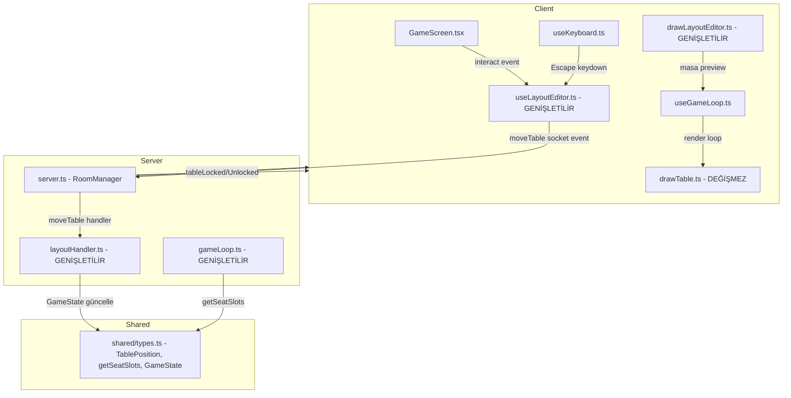
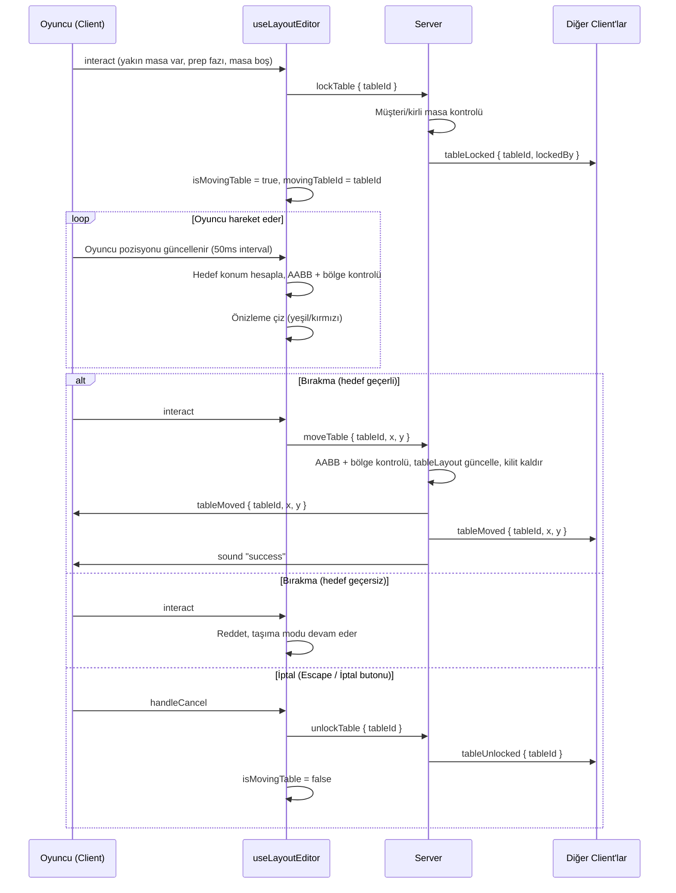

# Tasarım Belgesi: Table Layout Editor

## Genel Bakış

Bu özellik, PlateUp tarzı restoran oyununa **prep (hazırlık) fazında** müşteri masalarını yeniden düzenleme imkânı tanır. Oyuncular gün başlamadan önce masaları istedikleri konuma taşıyarak salon düzenini optimize edebilir.

Sistem mevcut `stationLayout` + `useLayoutEditor` + `drawLayoutEditor` altyapısıyla paralel çalışır. Aynı socket event pattern'i kullanılır (`lockTable`, `moveTable`, `unlockTable`). `LayoutEditorState` genişletilir — ayrı bir hook veya state oluşturulmaz.

Taşıma akışı sürükle-bırak değil, "yaklaş → interact → taşıma modu → hareket et → interact → bırak" şeklindedir. Bu, mevcut mobil joystick + AL/VER butonu ve PC E/Boşluk tuşu altyapısıyla tam uyumludur.

---

## Mimari

### Yüksek Seviye Bileşen Diyagramı



### Veri Akışı: Masa Taşıma İşlemi



---

## Bileşenler ve Arayüzler

### 1. `shared/types.ts` — Veri Modeli Genişletmesi

```typescript
// Yeni tip
export interface TablePosition {
  id: string;   // 'table0' .. 'table4'
  x: number;
  y: number;
}

// SEAT_SLOTS sabit array'i kaldırılır, yerine dinamik fonksiyon:
export function getSeatSlots(tableLayout: Record<string, TablePosition>): { x: number; y: number }[] {
  return Object.values(tableLayout).flatMap(t => [
    { x: t.x, y: t.y - 47 },
    { x: t.x, y: t.y + 47 },
  ]);
}

// GameState'e eklenen alanlar:
// tableLayout: Record<string, TablePosition>
// lockedTables: Record<string, string>  // tableId → socketId
```

`mkGameState()` içine eklenir:
```typescript
tableLayout: {
  table0: { id: 'table0', x: 190, y: 500 },
  table1: { id: 'table1', x: 390, y: 500 },
  table2: { id: 'table2', x: 640, y: 500 },
  table3: { id: 'table3', x: 890, y: 500 },
  table4: { id: 'table4', x: 1090, y: 500 },
},
lockedTables: {},
```

### 2. `src/types/game.ts` — Re-export Güncelleme

```typescript
// Kaldırılır:
export const TABLE_X_SLOTS = [190, 390, 640, 890, 1090];
export const TABLE_Y = 500;

// Eklenir:
export { type TablePosition, getSeatSlots } from '../../shared/types';
```

### 3. `server/layoutHandler.ts` — Genişletme

`registerLayoutHandler` içine masa event'leri eklenir:

```typescript
// Dinlenen yeni event'ler:
// "lockTable"   → { tableId: string }
// "moveTable"   → { tableId: string, x: number, y: number }
// "unlockTable" → { tableId: string }

// Yayımlanan yeni event'ler:
// "tableLocked"   → { tableId: string, lockedBy: string }
// "tableUnlocked" → { tableId: string }
// "tableMoved"    → { tableId: string, x: number, y: number }
```

`lockTable` event mantığı:
- `dayPhase !== 'prep'` → return
- `tableId` yoksa → return
- Masanın koltuklarında müşteri var mı? (`gs.customers.some(c => c.seatX === t.x && (c.seatY === t.y - 47 || c.seatY === t.y + 47))`) → return
- Masanın koltuklarında kirli masa var mı? (`gs.dirtyTables.some(...)`) → return
- Zaten kilitli mi? → `tableLocked` emit, return
- `gs.lockedTables[tableId] = socket.id`
- `io.to(roomId).emit("tableLocked", { tableId, lockedBy: socket.id })`

`moveTable` event mantığı:
```typescript
const MIN_TABLE_Y = 320;
const snapped = snapToGrid(x, y);
// Bölge kısıtları
if (snapped.y < MIN_TABLE_Y) return;
if (snapped.y >= WALL_Y1 && snapped.y <= WALL_Y2) return;
if (snapped.y > GAME_HEIGHT - 60) return;
// AABB çakışma
if (tableOverlaps(snapped.x, snapped.y, gs.tableLayout, tableId)) {
  socket.emit("sound", "fail"); return;
}
gs.tableLayout[tableId] = { id: tableId, x: snapped.x, y: snapped.y };
delete gs.lockedTables[tableId];
io.to(roomId).emit("tableMoved", { tableId, x: snapped.x, y: snapped.y });
io.to(roomId).emit("tableUnlocked", { tableId });
socket.emit("sound", "success");
```

AABB çakışma yardımcı fonksiyonu:
```typescript
function tableOverlaps(
  x: number, y: number,
  layout: Record<string, TablePosition>,
  excludeId: string
): boolean {
  return Object.values(layout).some(t =>
    t.id !== excludeId &&
    Math.abs(t.x - x) < TABLE_HALF_W * 2 + 10 &&
    Math.abs(t.y - y) < TABLE_HALF_H * 2 + 10
  );
}
```

`disconnect` handler'ına eklenir:
```typescript
for (const [tableId, lockedBy] of Object.entries(gs.lockedTables)) {
  if (lockedBy === socket.id) {
    delete gs.lockedTables[tableId];
    io.to(roomId).emit("tableUnlocked", { tableId });
  }
}
```

### 4. `server/gameLoop.ts` — Koltuk Sistemi Güncelleme

```typescript
// Önce:
import { SEAT_SLOTS } from "../shared/types.js";
// Sonra:
import { getSeatSlots } from "../shared/types.js";

// tryQueueSeat içinde:
// Önce:
const free = SEAT_SLOTS.filter(s => !occupied.has(`${s.x},${s.y}`));
// Sonra:
const free = getSeatSlots(gs.tableLayout).filter(s => !occupied.has(`${s.x},${s.y}`));
```

`customerTick` etkilenmez — müşteriler `seatX/seatY` değerlerini kendi üzerlerinde taşır, `SEAT_SLOTS`'a doğrudan bağımlı değildir.

### 5. `src/renderer/drawLayoutEditor.ts` — Genişletme

`LayoutEditorState` interface'i genişletilir:
```typescript
export interface LayoutEditorState {
  isMoving: boolean;
  movingStationId: string | null;
  originalPos: { x: number; y: number } | null;
  previewPos: { x: number; y: number } | null;
  isPreviewValid: boolean;
  // Yeni alanlar:
  isMovingTable: boolean;
  movingTableId: string | null;
}
```

Masa geçerlilik kontrolü için yeni yardımcı fonksiyon:
```typescript
export function isTablePositionValid(
  x: number, y: number,
  tableLayout: Record<string, TablePosition>,
  excludeId: string
): boolean {
  // AABB çakışma + bölge kısıtları
  const MIN_TABLE_Y = 320;
  if (y < MIN_TABLE_Y || y > GAME_HEIGHT - 60) return false;
  if (y >= WALL_Y1 && y <= WALL_Y2) return false;
  return !Object.values(tableLayout).some(t =>
    t.id !== excludeId &&
    Math.abs(t.x - x) < TABLE_HALF_W * 2 + 10 &&
    Math.abs(t.y - y) < TABLE_HALF_H * 2 + 10
  );
}
```

`drawLayoutPreview` masa preview'ını destekler:
- `isMovingTable` true ise `TABLE_HALF_W × TABLE_HALF_H` boyutunda outline çiz
- Geçerli: yeşil outline + masa emoji
- Geçersiz: kırmızı outline

### 6. `src/hooks/useLayoutEditor.ts` — Genişletme

`DEFAULT_STATE` güncellenir:
```typescript
const DEFAULT_STATE: LayoutEditorState = {
  isMoving: false, movingStationId: null,
  originalPos: null, previewPos: null, isPreviewValid: false,
  isMovingTable: false, movingTableId: null,
};
```

`handleInteract()` içine masa mantığı eklenir — istasyon kontrolünden ÖNCE:
```typescript
// 1. Masa taşıma modu aktifse → bırak
if (editorStateRef.current.isMovingTable) {
  const { movingTableId } = editorStateRef.current;
  const snapped = snapToGrid(lp.x, lp.y);
  const valid = isTablePositionValid(snapped.x, snapped.y, gs.tableLayout, movingTableId!);
  if (!valid) return;
  socket?.emit('moveTable', { tableId: movingTableId, x: snapped.x, y: snapped.y });
  setState(DEFAULT_STATE);
  return;
}

// 2. En yakın boş masa kontrolü
let closestTable: { id: string; dist: number } | null = null;
for (const [id, t] of Object.entries(gs.tableLayout)) {
  if (gs.lockedTables[id]) continue;
  // Masada müşteri/kirli masa varsa atla (UX kontrolü)
  const hasCust = gs.customers.some(c => c.seatX === t.x && (c.seatY === t.y - 47 || c.seatY === t.y + 47));
  const hasDirty = gs.dirtyTables.some(d => d.seatX === t.x && (d.seatY === t.y - 47 || d.seatY === t.y + 47));
  if (hasCust || hasDirty) continue;
  const dist = Math.hypot(lp.x - t.x, lp.y - t.y);
  if (dist < MOVE_INTERACT_R && (!closestTable || dist < closestTable.dist)) {
    closestTable = { id, dist };
  }
}
if (closestTable) {
  socket?.emit('lockTable', { tableId: closestTable.id });
  const snapped = snapToGrid(lp.x, lp.y);
  const valid = isTablePositionValid(snapped.x, snapped.y, gs.tableLayout, closestTable.id);
  setState({
    ...DEFAULT_STATE,
    isMovingTable: true,
    movingTableId: closestTable.id,
    originalPos: { x: gs.tableLayout[closestTable.id].x, y: gs.tableLayout[closestTable.id].y },
    previewPos: snapped,
    isPreviewValid: valid,
  });
  return;
}

// 3. Sonra istasyon kontrolü (mevcut mantık devam eder)
```

`handleCancel()` masa taşıma modunu da iptal eder:
```typescript
const { movingStationId, movingTableId } = editorStateRef.current;
if (movingStationId) socket?.emit('unlockStation', { stationId: movingStationId });
if (movingTableId) socket?.emit('unlockTable', { tableId: movingTableId });
setState(DEFAULT_STATE);
```

Preview interval'ı masa taşıma modunu da destekler:
```typescript
const interval = setInterval(() => {
  const state = editorStateRef.current;
  if (!state.isMoving && !state.isMovingTable) return;
  const { x, y } = localPlayerRef.current;
  const snapped = snapToGrid(x, y);
  const gs = gameStateRef.current;

  let valid: boolean;
  if (state.isMovingTable && state.movingTableId) {
    valid = isTablePositionValid(snapped.x, snapped.y, gs.tableLayout, state.movingTableId);
  } else if (state.movingStationId) {
    const { col, row } = pixelToGridIndex(snapped.x, snapped.y);
    valid = !isGridCellOccupied(col, row, gs.stationLayout, state.movingStationId);
  } else return;

  if (state.previewPos?.x !== snapped.x || state.previewPos?.y !== snapped.y || state.isPreviewValid !== valid) {
    setState({ ...state, previewPos: snapped, isPreviewValid: valid });
  }
}, 50);
```

Socket event listener'ları eklenir:
```typescript
socket.on('tableMoved', ({ tableId, x, y }) => {
  gs.tableLayout[tableId] = { id: tableId, x, y };
});
socket.on('tableLocked', ({ tableId, lockedBy }) => {
  gs.lockedTables[tableId] = lockedBy;
});
socket.on('tableUnlocked', ({ tableId }) => {
  delete gs.lockedTables[tableId];
});
```

### 7. `src/hooks/useGameLoop.ts` — Render Güncelleme

```typescript
// Kaldırılır:
import { TABLE_X_SLOTS, TABLE_Y } from "../types/game";

// drawFloorCached'e tablePositions parametresi eklenir:
function drawFloorCached(
  ctx, unlockedDishes, forceRedraw, ingPositions,
  tablePositions?: Record<string, { x: number; y: number }>
)

// Cache key'e masa pozisyonları dahil edilir:
const tablePosStr = tablePositions
  ? Object.entries(tablePositions).map(([k, v]) => `${k}:${v.x},${v.y}`).join(';')
  : '';
// cachedUnlockedDishes karşılaştırmasına tablePosStr eklenir

// Render içinde TABLE_X_SLOTS.forEach yerine:
const tableLayout = state.tableLayout ?? {};
const movingTableId = editorStateRef?.current?.movingTableId;
Object.values(tableLayout).forEach(t => {
  if (movingTableId === t.id) {
    // Orijinal konumda yarı saydam çiz
    offCtx.save(); offCtx.globalAlpha = 0.4;
    drawTable(offCtx, t.x, t.y);
    offCtx.restore();
  } else {
    drawTable(offCtx, t.x, t.y);
  }
});
```

---

## Veri Modelleri

### `TablePosition`

```typescript
export interface TablePosition {
  id: string;   // 'table0' .. 'table4'
  x: number;    // Grid'e snap'lenmiş piksel X
  y: number;    // Grid'e snap'lenmiş piksel Y
}
```

### `GameState` Genişletmesi

```typescript
export interface GameState {
  // ... mevcut alanlar ...
  tableLayout: Record<string, TablePosition>;
  lockedTables: Record<string, string>; // tableId → socketId
}
```

### Socket Event Şemaları

```typescript
// Client → Server
interface LockTablePayload   { tableId: string }
interface MoveTablePayload   { tableId: string; x: number; y: number }
interface UnlockTablePayload { tableId: string }

// Server → Client
interface TableLockedPayload   { tableId: string; lockedBy: string }
interface TableUnlockedPayload { tableId: string }
interface TableMovedPayload    { tableId: string; x: number; y: number }
```

---

## Doğruluk Özellikleri

### Özellik 1: Masa Taşıma Başlatma Koşulları

*Herhangi bir* oyuncu konumu, masa konumu ve oyun fazı için:
- `dayPhase === 'prep'` VE mesafe `< 75px` VE `holding === null` VE masa boş (müşteri/kirli masa yok) VE masa kilitli değil ise → taşıma modu başlamalıdır
- Bu koşullardan herhangi biri sağlanmıyorsa → taşıma modu başlamamalıdır

**Doğrular: Gereksinim 1.1, 1.3, 1.4, 1.5, 1.6, 2.1, 2.2**

---

### Özellik 2: AABB Çakışma Tespiti

*Herhangi iki* masa konumu için, `|dx| < TABLE_HALF_W * 2 + 10` VE `|dy| < TABLE_HALF_H * 2 + 10` ise `tableOverlaps` `true` döndürmeli; aksi halde `false` döndürmelidir.

**Doğrular: Gereksinim 4.1**

---

### Özellik 3: Bölge Kısıtı

*Herhangi bir* hedef konum için:
- `y < 320` → geçersiz
- `WALL_Y1 <= y <= WALL_Y2` → geçersiz
- `y > GAME_HEIGHT - 60` → geçersiz
- Diğer tüm konumlar → çakışma yoksa geçerli

**Doğrular: Gereksinim 4.2, 4.3, 4.4**

---

### Özellik 4: İptal Round-Trip

*Herhangi bir* taşıma modu durumu için, iptal işlemi sonrası `tableLayout[tableId]` taşıma başlamadan önceki orijinal koordinatlara eşit olmalıdır.

**Doğrular: Gereksinim 7.1, 7.2, 7.3**

---

### Özellik 5: Koltuk Senkronizasyonu

*Herhangi bir* `tableLayout` için, `getSeatSlots(tableLayout)` tam olarak `Object.keys(tableLayout).length * 2` adet koltuk döndürmeli ve her koltuk `{ x: t.x, y: t.y ± 47 }` olmalıdır.

**Doğrular: Gereksinim 6.1, 6.2**

---

### Özellik 6: Layout Broadcast

*Herhangi bir* başarılı `moveTable` işlemi için, aynı odadaki tüm client'ların `tableLayout[tableId]` değeri güncellenmiş koordinatları yansıtmalıdır.

**Doğrular: Gereksinim 5.3, 8.1, 8.2**

---

### Özellik 7: Masa Kilidi Round-Trip

*Herhangi bir* masa için, bir oyuncu tarafından kilitlendiğinde başka bir oyuncu taşıma modunu başlatamamalı; kilit serbest bırakıldıktan sonra ise başka bir oyuncu taşıma modunu başlatabilmelidir.

**Doğrular: Gereksinim 8.3, 8.4, 8.5**

---

## Hata Yönetimi

### Server Tarafı

| Durum | Davranış |
|---|---|
| `moveTable` prep fazı dışında gelirse | Event yoksayılır |
| Kilitli masaya başka oyuncu `lockTable` gönderirse | `tableLocked` event'i tekrar gönderilir, işlem reddedilir |
| Masada müşteri/kirli masa varken `lockTable` gelirse | Event yoksayılır |
| Geçersiz `tableId` gelirse | Event yoksayılır |
| Hedef konum yasak bölgedeyse | `"fail"` sesi emit edilir, işlem reddedilir |
| AABB çakışması varsa | `"fail"` sesi emit edilir, işlem reddedilir |
| Oyuncu disconnect olursa | Kilitlediği tüm masalar serbest bırakılır, `tableUnlocked` broadcast edilir |

### Client Tarafı

| Durum | Davranış |
|---|---|
| `tableMoved` alındığında `tableId` bulunamazsa | Hata loglanır, mevcut layout korunur |
| Taşıma modundayken `dayPhase` değişirse | Taşıma modu otomatik iptal edilir |
| `tableLayout` undefined gelirse | `{}` olarak varsayılan değer kullanılır |

---

## Etkilenen Dosyalar

| Dosya | Değişiklik Türü |
|---|---|
| `shared/types.ts` | `TablePosition`, `getSeatSlots`, `GameState` genişletme, `mkGameState` |
| `src/types/game.ts` | Re-export güncelleme, `TABLE_X_SLOTS`/`TABLE_Y` kaldır |
| `server/layoutHandler.ts` | `lockTable`, `moveTable`, `unlockTable`, `disconnect` güncelleme |
| `server/gameLoop.ts` | `SEAT_SLOTS` → `getSeatSlots(gs.tableLayout)` |
| `src/renderer/drawLayoutEditor.ts` | `LayoutEditorState` genişletme, `isTablePositionValid`, masa preview |
| `src/hooks/useLayoutEditor.ts` | Masa seçim/bırakma mantığı, socket event'leri, preview interval |
| `src/hooks/useGameLoop.ts` | `TABLE_X_SLOTS` kaldır, dinamik masa render, cache key güncelleme |
| `server/interactHandler.ts` | DEĞİŞMEZ — `seatX/seatY` müşteri üzerinde, `SEAT_SLOTS` kullanmıyor |
| `src/renderer/drawFloor.ts` | DEĞİŞMEZ — masa çizimi `useGameLoop`'ta |
| `src/renderer/drawTable.ts` | DEĞİŞMEZ — zaten parametrik `(cx, cy)` |
